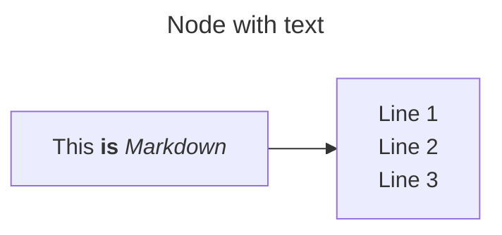

## 介绍
mermaid是一种用于绘图的标记语言，使用者可以用简单的代码制作常见的图表，如流程图、循序图、类图、状态图、关系图等。同时，mermaid还提供了[在线编辑网站](https://mermaid.js.org/syntax/flowchart.html#styling-links)，可以方便地导出对应图像。
在markdown中，一般使用以下代码使用mermaid：
```
```mermaid
<!-- 在此处放置 mermaid 代码 -->
```

## 流程图
### 示例
```
---
title: Node with text
---
flowchart LR
  markdown["`This **is** _Markdown_`"]
  newLines["`Line 1
  Line 2
  Line 3`"]
  markdown --> newLines
```


> [!note]  
> ceshi

### 节点

### 连接

### 排列布局
