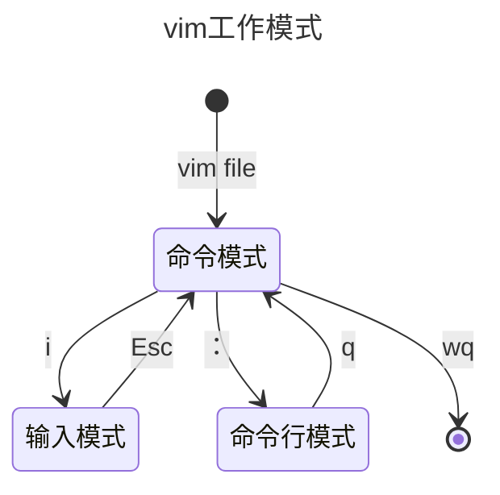

## vim工作模式
vim分为三种模式，命令模式（Command Mode）、输入模式（Insert Mode）和命令行模式（Command-Line Mode）。

* 命令模式（Command Mode）：命令模式是vim的默认模式，用于执行各种命令，如移动光标、删除文本、复制文本等。
* 输入模式（Insert Mode）：输入模式用于在当前光标位置插入文本。
* 命令行模式（Command-Line Mode）：命令行模式用于执行命令行命令，如保存文件、退出vim等。

当用户启动vim时，会进入命令模式。命令模式下输入字符'i'，进入输入模式。输入模式下按下Esc键，返回命令模式。命令模式下输入字符':',进入命令行模式。命令行模式下输入字符'q',退出vim。

## 输入模式常用操作
* **ENTER**，回车键，换行
* **BACK SPACE**，退格键，删除光标前一个字符
* **DEL**，删除键，删除光标后一个字符
* **方向键**，在文本中移动光标
* **HOME/END**，移动光标到行首/行尾
* **Page Up/Page Down**，上/下翻页

## 命令行模式常用操作
| 命令   | 解释                     |
| :----- | :----------------------- |
| :w     | 保存当前文件             |
| :w!    | 若文件属性为『只读』时，强制保存当前文件 |
| :q     | 退出vim                  |
| :q!    | 强制退出vim              |
| :wq    | 保存并退出vim            |
| :wq!   | 强制保存并退出vim        |
| ZZ     | 如果修改过，保存当前文件，然后退出！效果等同于(保存并退出)|
| ZQ     | 不保存，强制退出。效果等同于 :q!。|
|:w [filename] | 将编辑的数据储存成另一个档案（类似另存新档）|
|:r [filename] | 在编辑的数据中，读入另一个档案的数据。亦即将 『filename』 这个档案内容加到游标所在行后面|
|:n1,n2 w [filename] | 将 n1 到 n2 的内容储存成 filename 这个档案。|
|:! command |	暂时离开 vi 到指令行模式下执行 command 的显示结果！例如『:! ls /home』即可在 vi 当中察看 /home 底下以 ls 输出的档案信息！|
| :set nu | 开启行号显示 |
| :set nonu | 关闭行号显示 |

## 命令模式常用操作
### 光标移动操作
| 命令 | 解释 |
|:-----|:-----|
|方向键（hjkl）|光标移动一个字符|
|n方向键（hjkl）|光标移动n个字符|
|[Ctrl] + [f] |	屏幕『向下』移动一页，相当于 [Page Down]按键 (常用)|
|[Ctrl] + [b] |	屏幕『向上』移动一页，相当于 [Page Up] 按键 (常用)|
|[Ctrl] + [d]	| 屏幕『向下』移动半页|
|[Ctrl] + [u] |	屏幕『向上』移动半页|
|n[space]|	光标向右移动这一行的 n 个字符。|
|n[Enter]|	光标向下移动 n 行(常用) |
|0| 或功能键[Home]	移动到这一行的最前面字符处 (常用) |
|$| 或功能键[End]	移动到这一行的最后面字符处(常用) |
|G|	移动到这个档案的最后一行(常用) |
|nG|	移动到这个档案的第 n 行。例如 20G 则会移动到这个档案的第 20 行 |
|gg|	移动到这个档案的第一行 (常用) |
|H|	光标移动到这个屏幕的最上方那一行的第一个字符 |
|M|	光标移动到这个屏幕的中央那一行的第一个字符 |
|L|	光标移动到这个屏幕的最下方那一行的第一个字符 |

### 搜索替换
| 命令 | 解释 |
|:-----|:-----|
| /word |	向光标之下，搜索 word 这个字串 |
| ?word |	向光标之上，搜索 word 这个字串 |
| n |	重复上一次的搜索动作，继续向上(/word)或向下(?word)搜索word |
| N |	重复上一次的搜索动作，但方向相反 |
|:n1,n2s/word1/word2/g|在第 n1 与 n2 行之间寻找 word1 这个字符串，并将该字符串取代为 word2 |
| :%s/old/new/g |	将整个档案中所有的 old 字串替换为 new 字串 |

### 复制粘贴删除
| 命令 | 解释 |
|:-----|:-----|
| x,X | x为向后删除一个字符，X为向前删除一个字符 |
| nx | 向后连续删除 n 个字符 |
| dd | 剪切游标所在的那一整行(常用)|
| ndd | 剪切光标所在的向下 n 行 |
| d1G | 删除光标所在到第一行的所有数据 |
| dG | 删除光标所在到最后一行的所有数据 |
| d$ | 删除光标所在到该行行尾的所有数据 |
| d0 | 删除光标所在到该行行首的所有数据 |
| yy | 复制光标所在的那一整行(常用) |
| nyy | 复制光标所在的向下 n 行 |
| y1G; yG; y$; y0 | 与d类似 |
| p | 粘贴光标所在位置的下一行 |
| P | 粘贴光标所在位置的上一行 |
| J |	将光标所在行与下一行的数据结合成同一行 |
| c |	重复删除多个数据，例如向下删除 10 行[10cj] |
| u |	复原前一个动作(常用) |
| [Ctrl]+r |	重做上一个动作(常用) |
| . |	重复前一个动作的 |

### 切换到输入模式
| 命令 | 解释                     |
| :--- | :----------------------- |
| i, I | 插入光标所在位置的前一个字符 |
| a, A | 插入光标所在位置的后一个字符 |
| o    | 在光标所在行的下一行插入一行 |
| O    | 在光标所在行的上一行插入一行 |

## 参考资料
[1] [Linux vi/vim](https://www.runoob.com/linux/linux-vim.html)
